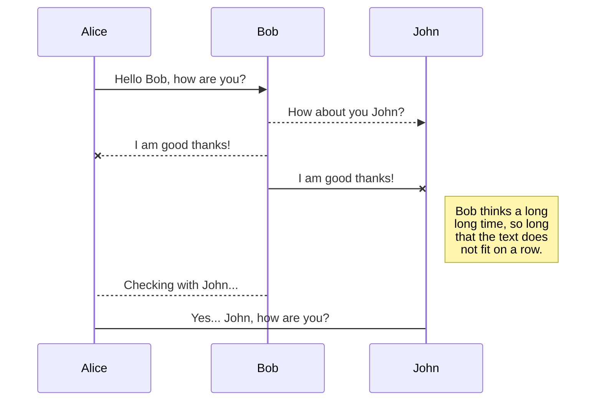
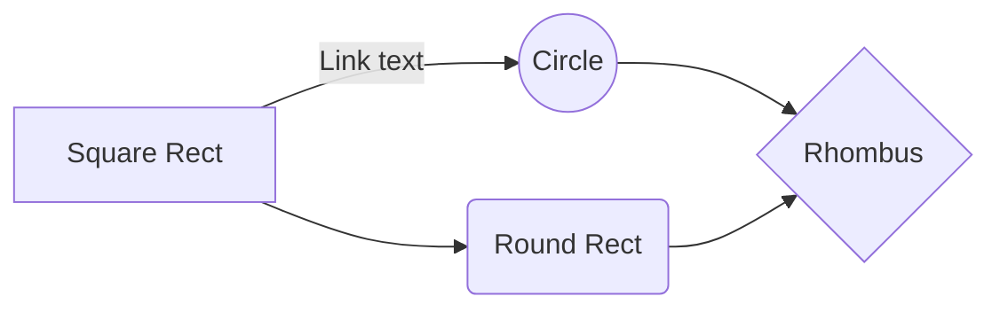

# Tamalito
El presente proyecto está constituido por una aplicación web y una aplicación de escritorio que comparten acceso a una misma base de datos. 

Esta aplicación multiplataforma permite realizar una orden de compra de tamales y atoles desde la página web como cliente, así como, registrar las ventas y administrar los inventarios en la aplicación de escritorio como empleado, gerente o dueño. 

La presente propuesta de negocio acompañada de la solución tecnológica presente en este repositorio nació como respuesta a los altos precios de la cafetería del [Instituto Tecnológico Autónomo de México](itam.mx), así como, de la gran fascinación por la gastronomía mexicana popular por parte de los miembros de este equipo. 

El desarrollo del proyecto se llevó a cabo como evidencia entregable para la calificación final de la materia de Desarrollo de Aplicaciones Informáticas impartida por la [Dra. Ana Lidia Franzoni](https://www.linkedin.com/in/ana-lidia-franzoni-5b19429) en el [ITAM](itam.mx),

## Equipo de desarrollo
- [Digeo Hernández Delgado](https://github.com/DiegoHuesos)
- [Ángel Zatarain López](https://github.com/angelzatarain)
- [José Carlos López]()
 - [Dra. Ana Lidia Franzoni](https://www.linkedin.com/in/ana-lidia-franzoni-5b19429)
 
## Caracteristicas del software utilizado

Para la interfaz gráfica de usuario (GUI por sus siglas en inglés) de la **aplicación de escritorio** se utiliza el *framework* de Microsoft **WPF**, así mismo, se implementaron las librerías **MaterialDesign** y **MaterialColorDesign**, mientras que la lógica de programación se desarrolló en el lenguaje de programación **C#**. 

Por otro lado, el *frontend* de **aplicación WEB** se desarrolló con **HTML** para la estructura de los elemementos, **CSS** para el estilo y animaciones de la estructura, **Javascript** para integrar los mapas de Google, el framework de Microsoft **.NET** para el desarrollo integral y **C#** como lenguaje de programación para la lógica de la aplicación.

En ambas aplicaciones, se accedió a la base de datos inicializada en el Manejador de Base de Datos (**DBMS** por sus siglas en inglés) conocido com Microsoft **SQLServer 2019 Developer** a través de un **driver** para poder agregar, modificar, borrar registros. 

## Sugerencias para la replicación e implementación

 1. Se debe inicializar la base de datos con el script proporcionado (ver sección 3.2) en SQL Server. 
 2. Se debe abrir el proyecto de WPF y WEB en Visual Studio 2019. 
 3. Antes correr el proyecto, revisar la conexión para comprobar que está configurada correctamente. 
 4. Inicializar los proyectos, tanto WPF como WEB.
 
## Funcionalidades y características de la aplicación 
### WPF
- Controlar el acceso a diferentes métodos dependiendo del tipo de usuario (dueño, gerente o empleado) .
- Permitir tomar una orden a cualquier tipo de usuario.
- Permitirle únicamente al dueño y los gerentes dar de alta, de baja, o promover a un empleado.
- Permitir que el dueño como los gerentes puedan añadir añadir inventario.
- Permitir acceso y visualización de las ventas al dueño del negocio para analizar y/o alterar los costos de los productos.


###  WEB
- Mediar la comunicación entre usuario y negocio. 
- Mostrar la página ágina de presentación con información sobre el negocio (landing page).
-  Registrar usuarios en la base de datos para tener un registro de quienes compran los productos. 
- Tras haberse registrado, el usuario puede ingresar a la plataforma para hacer pedidos. 
- Un usuario puede hacer más de un pedido y en cada pedido puede pedir cuantos productos quiera. 
- El usuario puede cerrar sus sesión.


## Restricciones 

- El proyecto debe ser ejecutado en Visual Studio 2019 y debe estar habilitada la conexión con SQLServer. 
- En la aplicación web:
	- Los usuarios no puede registrar más de una cuenta por cada correo electrónico.
	-  Al momento de realizar una orden, deben presionar dos botones, el primero para actualizar su orden y el segundo para confirmar la misma. 
- En  la aplicación de escritorio:
	- El dueño puede acceder a todos los métodos.
	- El gerente puede acceder a menos métodos que el dueño.
	- El empleado común, únicamente, puede procesar los pedidos de los clientes. 

## Trabajos relacionados

Tamalito puede identificarse, desde la perepectiva de la aplicación web, con los sistemas en el que el usuario puede comunicarse, haciendo pedidos desde una página web, con un restaurante desde una ubicación remota como las aplicaciones de Dominoes, UberEats y Rappi.  

Desde la perspectiva de la aplicación WPF, el proyecto puede identificarse con cualquier otro sistema de control centralizado de restaurantes restaurantes, ventas y administración de inventario.


```flow
st=>start: Start:>http://google.com[blank]
e=>end:>http://google.com
opl=>operation: My Operation
subl=>subroutine: My Subroutine
cond=>condition: Yes
or No?:>http://google.com
io=>inputoutput: catch something...

st->opl->cond
cond(yes)->io->e
cond(no)->subl(right)
```


## SmartyPants

SmartyPants converts ASCII punctuation characters into "smart" typographic punctuation HTML entities. For example:

|                |ASCII                          |HTML                         |
|----------------|-------------------------------|-----------------------------|
|Single backticks|`'Isn't this fun?'`            |'Isn't this fun?'            |
|Quotes          |`"Isn't this fun?"`            |"Isn't this fun?"            |
|Dashes          |`-- is en-dash, --- is em-dash`|-- is en-dash, --- is em-dash|


## UML diagrams

You can render UML diagrams using [Mermaid](https://mermaidjs.github.io/). For example, this will produce a sequence diagram:



And this will produce a flow chart:


<!--stackedit_data:
eyJwcm9wZXJ0aWVzIjoidGl0bGU6IFRhbWFsaXRvXG5hdXRob3
I6IERpZWdvIEhlcm7DoW5kZXogRGVsZ2Fkb1xudGFnczogJ1JF
QURNRSwgVGFtYWxpdG8sIFdQRiwgV0VCLCAuTkVULCBTUUxTZX
J2ZXInXG5jYXRlZ29yaWVzOiAnV0VCLCAuTkVULCBBUFAnXG5k
YXRlOiAyNC8wMi8yMDIxXG4iLCJoaXN0b3J5IjpbOTA2NzU2ND
kzLC0yMTI1MDg1MDg0LC04Mzk4NTM0OTksMTI3MzU3ODIxLC0x
MzIyMTk3MzA0LDEyNjE5MDcxNjgsOTM0NDAwNTk4LC03NDgzOT
MzNDMsLTE5MTc5ODg1MjNdfQ==
-->